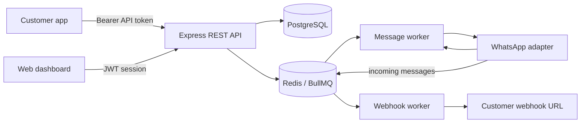
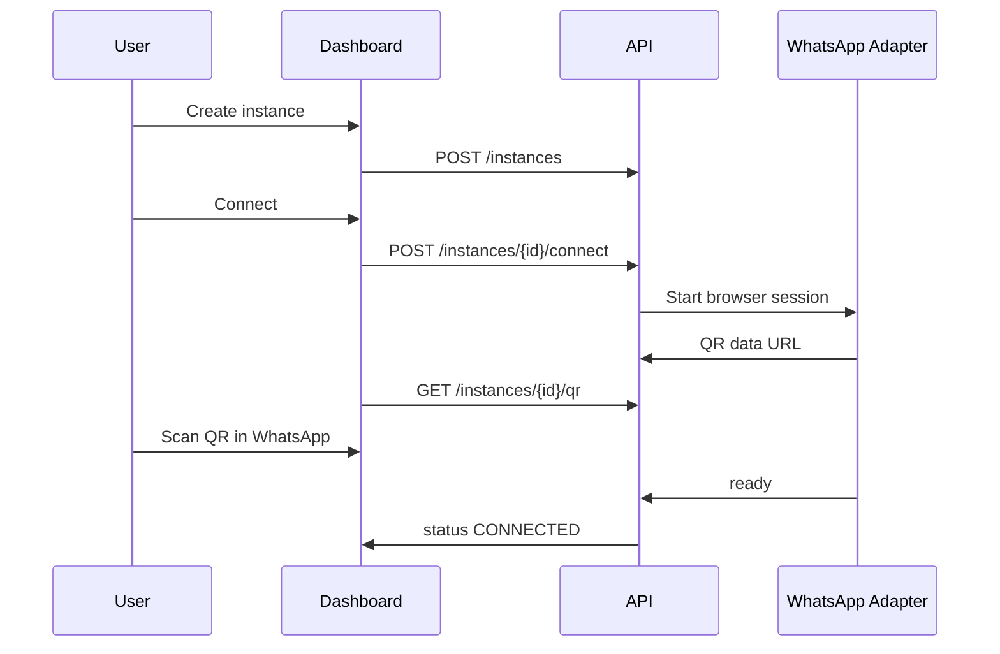
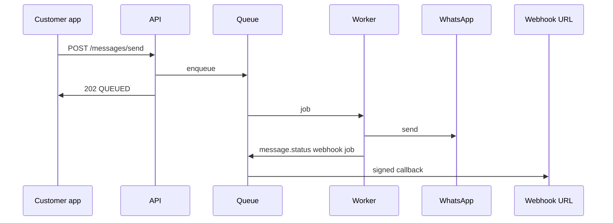

# HyperMSG Architecture

HyperMSG is a multi-tenant messaging API. Users own WhatsApp instances, API tokens, webhook endpoints, and message logs.

## Components

- REST API: authentication, instance lifecycle, token management, message enqueueing, message status lookup.
- WhatsApp adapter: wraps the underlying WhatsApp transport. The included adapter uses `whatsapp-web.js` for QR linking. For production SaaS, strongly consider the official WhatsApp Business Cloud API where possible.
- Message worker: sends queued messages, applies retry/backoff, updates logs, and emits delivery webhooks.
- Webhook worker: signs and POSTs event payloads to customer endpoints with retries.
- Dashboard: a small static app for operators and customers.

## Instance Flow

## Sending Flow

## Multi-Customer Hosting

- Keep every table scoped by `userId`.
- Run one isolated WhatsApp session per `Instance.id`.
- Store session files on durable encrypted storage if you run multiple API replicas.
- Use per-user and per-instance quotas, not only global limits.
- For high volume, shard workers by instance ID or customer tier.
- Put webhooks, media downloads, and WhatsApp browser sessions on separate worker pools.
- Never expose raw API tokens after creation; store only HMAC hashes.

## Queues, Retries, Rate Limits, and Account Safety

- Queue every outbound message and return `202 Accepted`.
- Use exponential backoff for transient failures.
- Enforce per-instance send ceilings. Start conservatively, for example 10-20 messages per minute.
- Add daily caps, warm-up limits for new accounts, duplicate-content detection, and opt-out lists.
- Prefer official WhatsApp Business APIs for commercial production traffic.
- Do not send unsolicited or scraped-contact campaigns. Keep explicit user consent, respect opt-outs, and avoid automation patterns that violate WhatsApp terms.
- Randomizing delays is not a substitute for consent, quality, and low complaint rates.
- Pause sending automatically when failure rates, blocks, spam reports, or disconnects spike.
